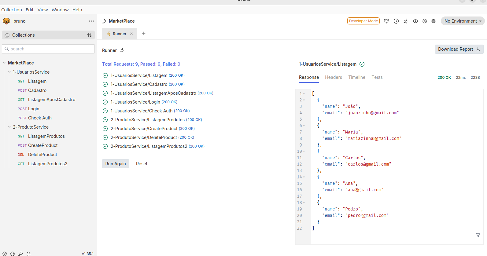
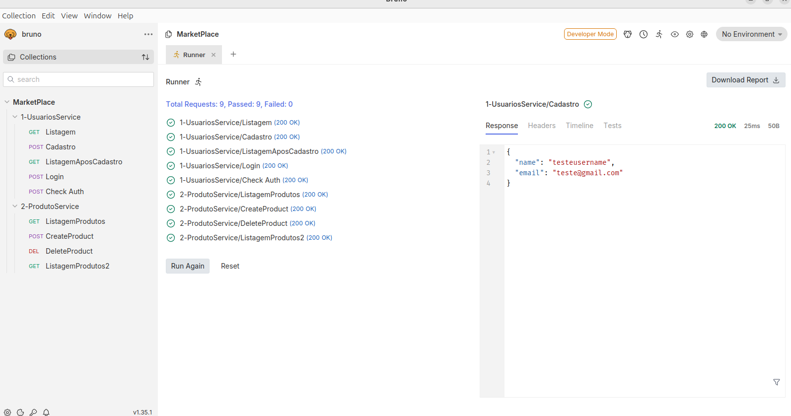
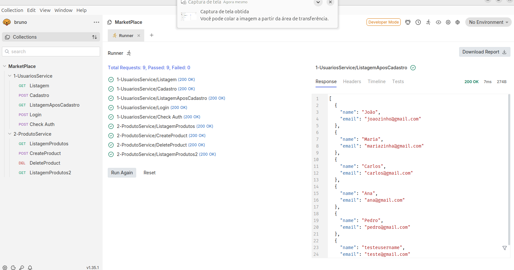
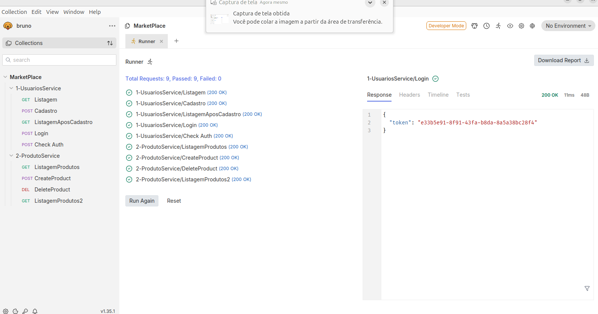
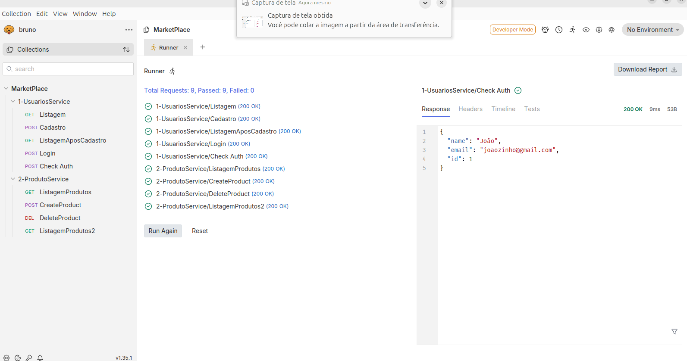
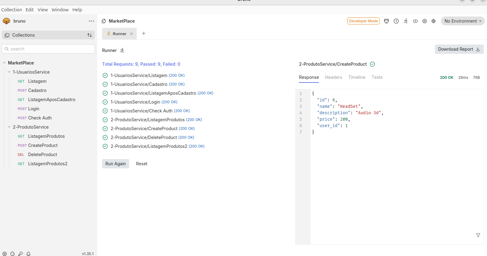
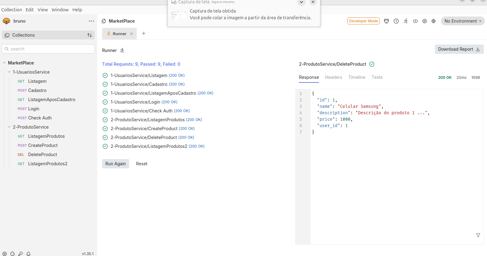
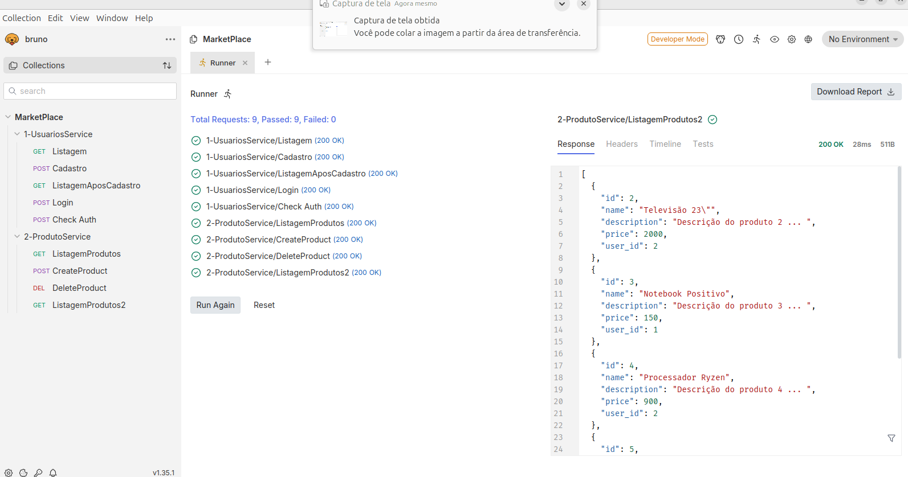

# Filipe Ribeiro de Almeida Silva - 2024.2 -Topicos Avançados em Web 2 - DevOps

# MarketPlace

Software desenvolvido usando arquitetura de microserviços

Software de marketplace, onde usuarios podem criar uma conta e anuciar produtos para venda


# Log do docker-compose

```plaintext

Creating atividadedevopsmicroservicosusuarios_usuarios-service_1 ... done
Creating atividadedevopsmicroservicosusuarios_produtos-service_1 ... done
Attaching to atividadedevopsmicroservicosusuarios_usuarios-service_1, atividadedevopsmicroservicosusuarios_produtos-service_1
usuarios-service_1  | INFO:     Started server process [1]
usuarios-service_1  | INFO:     Waiting for application startup.
usuarios-service_1  | INFO:     Application startup complete.
usuarios-service_1  | INFO:     Uvicorn running on http://0.0.0.0:8001 (Press CTRL+C to quit)
produtos-service_1  | INFO:     Started server process [1]
produtos-service_1  | INFO:     Waiting for application startup.
produtos-service_1  | INFO:     Application startup complete.
produtos-service_1  | INFO:     Uvicorn running on http://0.0.0.0:8002 (Press CTRL+C to quit)
usuarios-service_1  | Produtos service rodando...
usuarios-service_1  | Listando usuários...
usuarios-service_1  | INFO:     172.30.0.1:46978 - "GET /users HTTP/1.1" 200 OK
usuarios-service_1  | Criando usuário:  id=6 name='testeusername' email='teste@gmail.com' password='testesenha' token=''
usuarios-service_1  | INFO:     172.30.0.1:46978 - "POST /users HTTP/1.1" 200 OK
usuarios-service_1  | Listando usuários...
usuarios-service_1  | INFO:     172.30.0.1:46978 - "GET /users HTTP/1.1" 200 OK
usuarios-service_1  | Autenticando usuário:  id=6 name='testeusername' email='teste@gmail.com' password='testesenha' token='e33b5e91-8f91-43fa-b8da-8a5a38bc28f4' 
usuarios-service_1  | token:  e33b5e91-8f91-43fa-b8da-8a5a38bc28f4
usuarios-service_1  | INFO:     172.30.0.1:46978 - "POST /users/login HTTP/1.1" 200 OK
usuarios-service_1  | Verificando token de usuário:  9b133aca-a372-4cd0-9e57-85bbf6910489
usuarios-service_1  | id=1 name='João' email='joaozinho@gmail.com' password='123456' token='9b133aca-a372-4cd0-9e57-85bbf6910489'
usuarios-service_1  | Token válido id=1 name='João' email='joaozinho@gmail.com' password='123456' token='9b133aca-a372-4cd0-9e57-85bbf6910489'
usuarios-service_1  | INFO:     172.30.0.1:46978 - "POST /users/checkauth HTTP/1.1" 200 OK
produtos-service_1  | Listando produtos
produtos-service_1  | INFO:     172.30.0.1:40602 - "GET /products HTTP/1.1" 200 OK
usuarios-service_1  | Verificando token de usuário:  9b133aca-a372-4cd0-9e57-85bbf6910489
usuarios-service_1  | id=1 name='João' email='joaozinho@gmail.com' password='123456' token='9b133aca-a372-4cd0-9e57-85bbf6910489'
usuarios-service_1  | Token válido id=1 name='João' email='joaozinho@gmail.com' password='123456' token='9b133aca-a372-4cd0-9e57-85bbf6910489'
usuarios-service_1  | INFO:     172.30.0.3:48276 - "POST /users/checkauth HTTP/1.1" 200 OK
produtos-service_1  | Verificando token de usuário:  9b133aca-a372-4cd0-9e57-85bbf6910489
produtos-service_1  | Token válido:  9b133aca-a372-4cd0-9e57-85bbf6910489 {'name': 'João', 'email': 'joaozinho@gmail.com', 'id': 1}
produtos-service_1  | Criando produto:  id=6 name='HeadSet' description='Audio 3d' price=200.0 user_id=1
produtos-service_1  | INFO:     172.30.0.1:40602 - "POST /products HTTP/1.1" 200 OK
usuarios-service_1  | Verificando token de usuário:  9b133aca-a372-4cd0-9e57-85bbf6910489
usuarios-service_1  | id=1 name='João' email='joaozinho@gmail.com' password='123456' token='9b133aca-a372-4cd0-9e57-85bbf6910489'
usuarios-service_1  | Token válido id=1 name='João' email='joaozinho@gmail.com' password='123456' token='9b133aca-a372-4cd0-9e57-85bbf6910489'
usuarios-service_1  | INFO:     172.30.0.3:48282 - "POST /users/checkauth HTTP/1.1" 200 OK
produtos-service_1  | Verificando token de usuário:  9b133aca-a372-4cd0-9e57-85bbf6910489
produtos-service_1  | Token válido:  9b133aca-a372-4cd0-9e57-85bbf6910489 {'name': 'João', 'email': 'joaozinho@gmail.com', 'id': 1}
produtos-service_1  | Deletando produto:  id=1 name='Celular Samsung' description='Descrição do produto 1 ...' price=1000.0 user_id=1
produtos-service_1  | INFO:     172.30.0.1:40602 - "DELETE /products HTTP/1.1" 200 OK
produtos-service_1  | Listando produtos
produtos-service_1  | INFO:     172.30.0.1:40602 - "GET /products HTTP/1.1" 200 OK

```

# Teste da api

## Bruno

O software de teste de api Bruno foi escolhido pois ele permite compartilhar o arquivo de teste no propio repositorio git, coisa que outros software geralmente dificultam, com intenção que o usuario crie conta neles.

## Imagens dos testes

(Os testes foram realizados com a aplicação executando no compose)

### Listagem de Usuarios



### Cadastro de Usuarios



### Listagem Apos Cadastro




### Login




### Check Auth




### Listagem Produtos


### Create Produto




### Delete Produto




### Listagem Produtos Apos Delete




